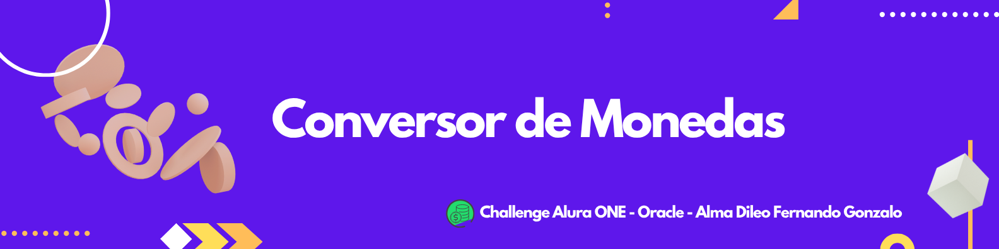

***Conversor de Monedas - Versión 1.0***

## Descripción General

**Conversor de Monedas** es una aplicación desarrollada en **Java** que permite convertir valores entre distintas monedas utilizando tasas de cambio dinámicas obtenidas a partir de una API externa.

Esta es la **primera versión** del proyecto, enfocada en la **lógica central de conversión**, y establece la base para un proyecto fullstack completo en el futuro. 

---

##  Estructura del Proyecto

```plaintext
Conversor de Monedas - ALURA ONE/
│
├── .idea/                             # Archivos de configuración del IDE
├── out/                               # Archivos compilados (.class)
├── src/                               # Código fuente y recursos
│   ├── assets/                        # Recursos estáticos (imágenes, etc)
│   │   └── ConversordeMonedas.png     # Imagen de portada del proyecto
│   └── com/
│       └── aluracursos/
│           └── conversordemonedas/
│               ├── logica/            # Lógica de negocio y clases principales
│               │   ├── ConsultarAPI.java
│               │   ├── ConversionRates.java
│               │   ├── Conversor.java
│               │   └── Monedas.java
│               └── principal/          # Clase principal para ejecución
│                   └── Principal.java
├── gson-2.13.1.jar                    # Librería para procesamiento JSON
├── .gitignore                        # Archivos y carpetas ignoradas en Git
├── Conversor de Monedas - ALURA ONE.iml  # Archivo de proyecto del IDE
└── README.md                         
````

---

##  Características Principales (v1.0)

| Funcionalidad                                   | Estado        |
| ----------------------------------------------- | ------------- |
| Obtención de tasas de cambio vía API (simulado) | Implementado  |
| Conversión bidireccional                        | ✔️            |
| Manejo de múltiples opciones                    | ✔️            |
| Validación básica de entradas                   | En desarrollo |
| Interfaz gráfica (GUI)                          | ❌             |
| Seguridad y validación avanzada                 | ❌             |
| Arquitectura fullstack                          | ❌             |

---

##  Tecnologías Utilizadas

* **Java 21+**
* **Gson 2.13.1** para manejo y parseo de JSON.
* Consumo de API REST para tasas de cambio (implementación en desarrollo).
* IDE: IntelliJ IDEA (u otro compatible con Java).

---

##  Uso

1. **Clonar el repositorio:**

```bash
git clone https://github.com/fernando-alma/Conversor-de-Monedas---ALURA-ONE.git
```

2. **Compilar el proyecto (desde la raíz):**

```bash
javac -cp gson-2.13.1.jar -d out/ src/com/aluracursos/conversordemonedas/logica/*.java src/com/aluracursos/conversordemonedas/principal/Principal.java
```

3. **Ejecutar la aplicación:**

```bash
java -cp "out;gson-2.13.1.jar" com.aluracursos.conversordemonedas.principal.Principal
```

> Nota: Ajustar el separador `;` por `:` en sistemas Unix/Linux/Mac.

4. **Pasos para usar la conversión:**

* Seleccionar la opción de conversión según las opciones disponibles.
* Ingresar el monto a convertir.
* Visualizar el resultado obtenido en consola.

---

##  Próximas Mejoras

| Funcionalidad                               | Estado Actual | 
| ------------------------------------------- | ------------- | 
| Integrar interfaz gráfica (GUI)             | No iniciado   |
| Conexión con API real para tasas            | En desarrollo | 
| Mejoras en validación y manejo de errores   | Pendiente     | 
| Seguridad (validaciones, autenticación)     | Planeado      | 
| Arquitectura fullstack (backend + frontend) | Planeado      | 
| Pruebas unitarias e integración             | Planeado      | 

---


##  Licencia

Este proyecto es para uso personal y educativo. Para usos comerciales o distribución, contacta al autor.

---

##  Autor

**Alma Dileo Fernando Gonzalo**
Desarrollador Fullstack.

Contacto: \  [LinkedIn](https://www.linkedin.com/in/fernando-alma/) | [GitHub](https://github.com/fernando-alma)

---

> *“Este es solo el comienzo. En un futuro cercano, esta app será una plataforma robusta, segura y completa para convertir monedas a un nivel más pro.”*

---